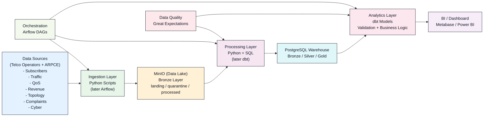

# telco-regulator-pipeline

> Open-source reference data platform for telecoms sector regulation. Demonstrates batch and streaming ingestion of operator submissions, automated data quality validation, multi-layer transformations, and self-service analytics — built on the modern open-source data stack.

[](#project-status)
[](LICENSE)
[](https://www.python.org/downloads/)
[](docker-compose.yml)

## Why this exists

Telecoms regulators worldwide manage critical national data flows — operator subscriber counts, traffic, quality of service, revenue, network coverage, security incidents — but most still operate this data infrastructure with Excel and email. This project is a reference implementation of what a modern, reproducible, fully open-source regulatory data platform looks like, calibrated to a realistic emerging-market context.

## What it does

- Simulates monthly regulatory submissions from 8 fictional telecom operators across 12 administrative regions
- Ingests structured data into a medallion-architecture warehouse (bronze, silver, gold)
- Validates incoming data against declarative quality rules
- Transforms raw submissions into business-ready analytical models
- Serves dashboards for sector observatories and internal regulatory analytics
- Runs end-to-end on a single laptop via Docker Compose

## Architecture



## Tech stack

| Layer | Technology |
|---|---|
| Object storage | MinIO (S3-compatible) |
| Orchestration | Apache Airflow |
| Warehouse | PostgreSQL 16 |
| Transformation | dbt-core |
| Validation | Great Expectations |
| BI | Metabase |
| Streaming | Apache Kafka, Spark Structured Streaming |
| CI/CD | GitHub Actions |
| Container runtime | Docker, Docker Compose |

## Quick start

```bash
git clone https://github.com/mintyfizz/telco-regulator-pipeline.git
cd telco-regulator-pipeline
docker compose up -d
```

After ~2 minutes (first run downloads images), the stack is up:

- PostgreSQL: `localhost:5432` (user: `telco_admin`, password: `changeme_local_only`, database: `telco_warehouse`)
- MinIO API: `localhost:9000`
- MinIO Console: `localhost:9001` (user: `minio_admin`, password: `changeme_local_only`)

Stop the stack with `docker compose down`. Use `docker compose down -v` to also clear data.

## Project status

Early development. Built incrementally as a learning project documenting modern data engineering practice. See the roadmap below.

## Roadmap

- [x] v0.1 — Repository structure, license, initial documentation
- [ ] v0.2 — Docker Compose stack with PostgreSQL and MinIO
- [ ] v0.3 — Synthetic data generator
- [ ] v0.4 — Airflow batch ingestion DAGs
- [ ] v0.5 — Great Expectations validation
- [ ] v0.6 — dbt staging and marts models
- [ ] v0.7 — Metabase dashboards
- [ ] v1.0 — Production-ready release with full documentation

## License

MIT — see [LICENSE](LICENSE).

## Author

Thomas Gatse — [github.com/mintyfizz](https://github.com/mintyfizz)
