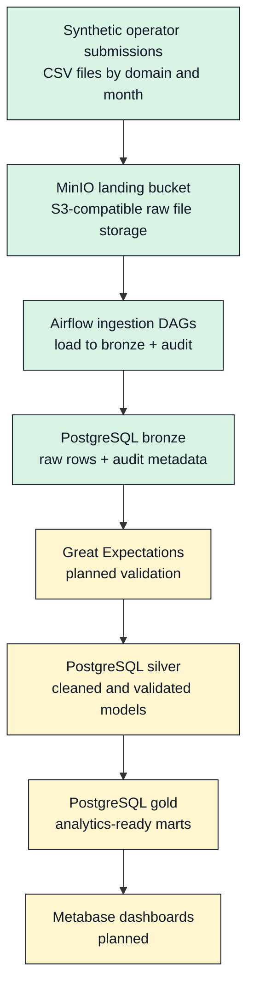

# telco-regulator-pipeline

> A local, open-source telecom regulator data platform: synthetic operator submissions, PostgreSQL bronze warehouse, MinIO object storage, and a roadmap toward validation, dbt models, and BI dashboards.

[](#project-status)
[](LICENSE)
[](https://www.python.org/downloads/)
[](docker-compose.yml)

## Overview

Telecom regulators manage critical national data flows: subscriber counts, voice/SMS/data traffic, quality of service, revenue, coverage, complaints, and security incidents. In many contexts, these flows still arrive as spreadsheets and email attachments.

This project models what a modern regulatory data platform can look like using a local open-source stack. It is calibrated to a realistic Republic of Congo telecom market structure, but all operator names and generated submissions are fictional.

## Project Status

Implemented now:

- Docker Compose stack with PostgreSQL 16, MinIO, and Apache Airflow.
- PostgreSQL medallion schemas: `bronze`, `silver`, `gold`, and `audit`.
- Bronze tables for subscribers, voice traffic, SMS traffic, internet traffic, QoS, and revenue.
- Silver reference data for 7 fictional operators and 15 Congolese departments.
- Synthetic data generator for monthly 2020-2024 regulatory submissions.
- MinIO upload flow using segment-aware object paths.
- Airflow bronze ingestion DAGs with audit logging and processed/quarantine file movement.

Next:

- Great Expectations validation and quarantine rules on top of bronze data.

Planned:

- dbt silver/gold transformations.
- Metabase dashboards for sector observatory analytics.

## What It Generates

The generator produces monthly CSV submissions across six regulatory domains:

| Domain | Bronze table | Grain |
|---|---|---|
| Subscribers | `bronze.subscribers` | operator, period, department, service segment |
| Voice traffic | `bronze.traffic_voice` | operator, period, department |
| SMS traffic | `bronze.traffic_sms` | operator, period, department |
| Internet traffic | `bronze.traffic_internet` | operator, period, department |
| Quality of service | `bronze.qos` | operator, period, department |
| Revenue | `bronze.revenue` | operator, period |

For a full 2020-2024 run, expected row counts are:

| Domain | Rows |
|---|---:|
| `subscribers` | 14,400 |
| `traffic_voice` | 1,800 |
| `traffic_sms` | 1,800 |
| `traffic_internet` | 1,800 |
| `qos` | 1,800 |
| `revenue` | 120 |

Late-2024 generated values are calibrated around these anchors:

- About 6.05M mobile telephony subscribers.
- About 3.76M mobile internet subscribers.
- About 508M outgoing voice minutes per month.
- About 7.6B mobile internet MB per month.
- About 16B XAF total monthly revenue.

## Architecture



## Data Model

The warehouse initializes four schemas:

| Schema | Purpose |
|---|---|
| `bronze` | Raw submissions captured with audit metadata. |
| `silver` | Curated reference data now; validated models later. |
| `gold` | Future analytics-ready marts. |
| `audit` | Pipeline run and file ingestion tracking. |

The silver reference layer currently seeds:

- 7 fictional telecom operators: 2 mobile operators, 1 state-owned fixed operator, and 4 ISPs.
- 15 Congolese departments with 2023 population, area, density, zone, and urban-concentration flags.

## Quick Start

Clone the project:

```bash
git clone https://github.com/mintyfizz/telco-regulator-pipeline.git
cd telco-regulator-pipeline
```

Install Python dependencies:

```bash
uv sync
```

Start local services:

```bash
docker compose up -d
```

Available services:

| Service | URL / Port | Credentials |
|---|---|---|
| PostgreSQL | `localhost:5433` | `telco_admin` / `changeme_local_only` |
| MinIO API | `localhost:9000` | `minio_admin` / `changeme_local_only` |
| MinIO Console | `http://localhost:9001` | `minio_admin` / `changeme_local_only` |
| Airflow UI | `http://localhost:8080` | `admin` / `admin` |

Generate the full synthetic dataset:

```bash
uv run telco-generate generate --start-year 2020 --end-year 2024 --output-dir output
```

Generated files are written to:

```text
output/<domain>/<year>/<report_period>.csv
```

Example:

```text
output/traffic_sms/2020/2020-01.csv
```

Generated output is ignored by git. Keep the generator code, not generated data, under version control.

Upload generated files to MinIO:

```bash
uv run telco-generate upload --output-dir output/
```

The upload command writes segment-aware object keys:

```text
landing/mobile/<operator_id>/<domain>/<year>/<month>/<domain>_<period>.csv
```

Run the bronze ingestion DAGs:

```bash
docker exec telco_airflow_scheduler airflow dags test bronze_subscribers_ingestion 2026-05-07
docker exec telco_airflow_scheduler airflow dags test bronze_mobile_domains_ingestion 2026-05-08
```

After a successful full ingestion, expected storage state is:

```text
landing:    0 objects
processed:  720 objects
quarantine: 0 objects
```

## Useful Commands

```bash
# Start services
docker compose up -d

# Show service status
docker compose ps

# Stop services
docker compose down

# Stop services and clear local volumes
docker compose down -v

# Generate synthetic data
uv run telco-generate generate --start-year 2020 --end-year 2024 --output-dir output

# Upload generated data to MinIO landing
uv run telco-generate upload --output-dir output/

# Verify MinIO object counts
uv run telco-generate verify

# Check Airflow DAG import errors
docker exec telco_airflow_scheduler airflow dags list-import-errors
```

## Repository Layout

```text
airflow/                 Airflow DAGs and ingestion helper library
data_generator/          Synthetic telecom submission generator
dbt_project/             Future dbt models and tests
docs/                    Design notes, decisions, screenshots
great_expectations/      Future data quality project
infra/postgres/init/     PostgreSQL schema and seed SQL
scripts/                 Utility scripts
docker-compose.yml       Local PostgreSQL and MinIO stack
pyproject.toml           Python package and tool configuration
uv.lock                  Locked Python dependency resolution
```

## Tech Stack

| Layer | Technology | Status |
|---|---|---|
| Synthetic data | Python, NumPy, Pydantic, Click | Implemented |
| Object storage | MinIO | Running locally |
| Warehouse | PostgreSQL 16 | Bronze implemented |
| Orchestration | Apache Airflow | Bronze ingestion implemented |
| Validation | Great Expectations | Planned |
| Transformation | dbt-core | Planned |
| BI | Metabase | Planned |
| Packaging | uv | Implemented |
| Container runtime | Docker Compose | Implemented |

## Roadmap

- [x] v0.1 - Repository structure, license, initial documentation
- [x] v0.2 - Docker Compose stack with PostgreSQL and MinIO
- [x] v0.3 - Bronze schema, audit infrastructure, and reference data
- [x] v0.4 - Synthetic data generator
- [x] v0.5 - Upload generated CSVs to MinIO landing bucket
- [x] v0.6 - Airflow batch ingestion DAGs
- [ ] v0.7 - Great Expectations validation and quarantine
- [ ] v0.8 - dbt staging and marts models
- [ ] v0.9 - Metabase dashboards
- [ ] v1.0 - Production-ready release with full documentation

## License

MIT - see [LICENSE](LICENSE).

## Author

Thomas Gatse - [github.com/mintyfizz](https://github.com/mintyfizz)
